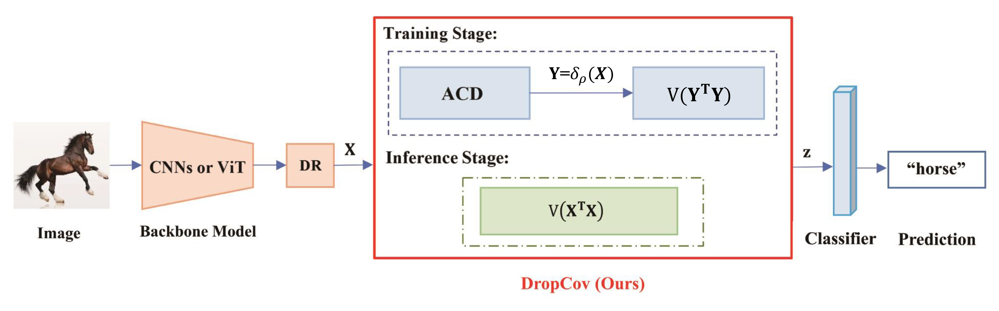

# Dropcov_mindspore

This is an code implementation of NeurIPS2022 paper using mindspore([DropCov: A Simple yet Effective Method for Improving Deep Architectures](https://arxiv.org/) ([poster](https://github.com/))), created by Qilong Wang, Mingze Gao and Zhaolin Zhang.


## Introduction
Post-normalization plays a key role in deep global covariance pooling (GCP) networks. In this paper, we for the first time show that effective post-normalization can make a good trade-off between representation decorrelation and information preservation for GCP, which are crucial to alleviate over-fitting and increase representation ability of deep GCP networks, respectively. Based on this finding, we propose a simple yet effective pre-normalization method for GCP (namely DropCov), which performs an adaptive channel dropout before GCP to achieve tradeoff between representation decorrelation and information preservation. The proposed DropCov improves performance of both deep CNNs and ViTs.


## Main Results on ImageNet with Pretrained Models


|Method           | Acc@1(%) | #Params.(M) | FLOPs(G) | Checkpoint                                                          |
| ------------------ | ----- | ------- | ----- | ------------------------------------------------------------ |
| ResNet-50   |  76.07 |  25.6   |   3.86  |               |
| ResNet-50+DropCov(Ours)   | 77.77  |   32.0  |  6.19   |[Download](https://drive.google.com/file/d/1PBy8evHi-xiJHiTWgqrUs8jTH58hJM2n/view?usp=share_link)|

## Usage
### Environments
●OS：18.04  
●CUDA：11.6  
●Toolkit：mindspore1.9  
●GPU:GTX 3090 

### Install

●First, Install the driver of NVIDIA 
●Then, Install the driver of CUDA 
●Last, Install cudnn 

create virtual enviroment mindspore
conda create -n mindspore python=3.7.5 -y
conda activate mindspore
CUDA 10.1 
```bash
conda install mindspore-gpu cudatoolkit=10.1 -c mindspore -c conda-forge
```
CUDA 11.1 
```bash
conda install mindspore-gpu cudatoolkit=11.1 -c mindspore -c conda-forge
```

### Data preparation

Download and extract ImageNet train and val images from http://image-net.org/. 
The directory structure is the standard layout for the torchvision [`datasets.ImageFolder`](https://pytorch.org/docs/stable/torchvision/datasets.html#imagefolder), 
and the training and validation data is expected to be in the `train/` folder and `val/` folder respectively:

```
/path/to/imagenet/
  train/
    class1/
      img1.jpeg
    class2/
      img2.jpeg
  val/
    class1/
      img3.jpeg
    class/2
      img4.jpeg
```

### Evaluation

To evaluate a pre-trained model on ImageNet val with GPUs run:

```bash
CUDA_VISIBLE_DEVICES={device_ids}  python  -u main.py  -e -a {model_name} --resume {checkpoint-path} {imagenet-path}
```


### Training

#### Train with ResNet

You can run the `main.py` to train as follow:

```
CUDA_VISIBLE_DEVICES={device_ids} python -u main.py -a {model_name} --epochs {epoch_num} --b {batch_size} --lr_mode {the schedule of learning rate decline} {imagenet-path}
```
For example:

```bash
CUDA_VISIBLE_DEVICES=0,1,2,3 python  -u main.py  -a resnet18_ACD --epochs 100 --b 256 --lr_mode LRnorm  ./dataset/ILSVRC2012
```

## Citation

```
@inproceedings{wang2022nips,
  title={A Simple yet Effective Method for Improving Deep Architectures},
  author={Qilong Wang and Mingze Gao and Zhaolin Zhang and Jiangtao Xie and Peihua Li and Qinghua Hu},
  booktitle = {NeurIPS},
  year={2022}
}
```

# Acknowledgement


Our code are built following 
[GCP_Optimization](https://github.com/ZhangLi-CS/GCP_Optimization),
[DeiT](https://github.com/facebookresearch/deit),
[Swin Transformer](https://github.com/microsoft/Swin-Transformer)
, thanks for their excellent work
